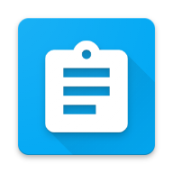

# APNotepad
All purpose notepad for Android
### Members
Etienne Gubler  
Tristan Leonhart  
William Darmawan  

  

APNotepad is an all purpose note taking app with features such as folder system, checklist
notes on top of normal notes with customizable emoji as icons for each folder and notes, and
export-import functionality. It has compatibility with various devices with various configurations,
from screen size, orientation, and even with the device's theme, whether it is dark or light mode.  

  
   

APNotepad’s layout would consist of the titlebar and the main viewing part. The titlebar is also
home to a menu dropdown represented by three dots on the top right of the screen. When
pressed, a list of menu items will show up as follows.  

 
Here users will be able to generate a normal, plain note as well as a checklist note. Users will
also be able to create a folder where it could store notes or subfolders. These will be stored to a
local database which could be compiled and exported as a backup to all the existing folders and
files. The exported backup file could also be imported from this menu dropdown.  

  
   

By pressing the “Add Note” option, users would be greeted by this empty note which title, text
and emoji could be edited as a part to identify the notes easier. The content would automatically
be saved once anything is altered on the screen, whether users returned to the main screen or
even cleared the app from recent apps directly after editing anything.  

By pressing the “Add Checklist” option, the app will show an empty list that the user can add to
by pressing the “+” button on the bottom right of the screen. Each item can be marked with a
tick to show whether it’s completed or not. Each item can be deleted by long pressing, which will
show a popup message to give the user a chance to confirm the deletion.  

“Add folder” option would bring out this popup which would provide users with options to name
and customize the folder’s icon. The folder would then be created with the provided information
on the directory where users pressed the add folder button on.  

When users navigated into a folder, a simple directory guide would show up on top of the
folder’s contents to indicate where users currently are. In a folder, users could add notes,
checklists, and folders, which means there could be an unlimited depth of the nested folders.  

After a new folder is created, this would what’s displayed when the folder is empty.  

Users could delete a note or checklist by long pressing the item which would then prompt them
to confirm the deletion.  

Long pressing a folder will give the user the option to rename the folder, change its emoji icon,
or delete the folder entirely. By deleting a folder, all the content inside the folder, whether it is a
folder, a note, or everything combined, will be deleted.  

To export the database, the user can press the menu button on the top right and select export.
This will give the user an .apn file that can be shared to various applications. While the main
purpose of this feature is as a backup of the notes, folders and the directories, the file could also
be sent to other users who have this application, where they can import the .apn file and have
the same database copy as the sender.  

Users could import a set of notes by selecting import from the menu dropdown and selecting the
.apn file that was just exported (mentioned above). When importing for the first time, the app
would prompt them for permission to access media on their device.  

After permitting the app, users could pick the .apn file from their local storage or cloud services
such as Google Drive.  

If users cancelled the import, or imported an invalid file, an “Import failed” note would show up at
the bottom of the screen notifying them that their local database is not altered.  
